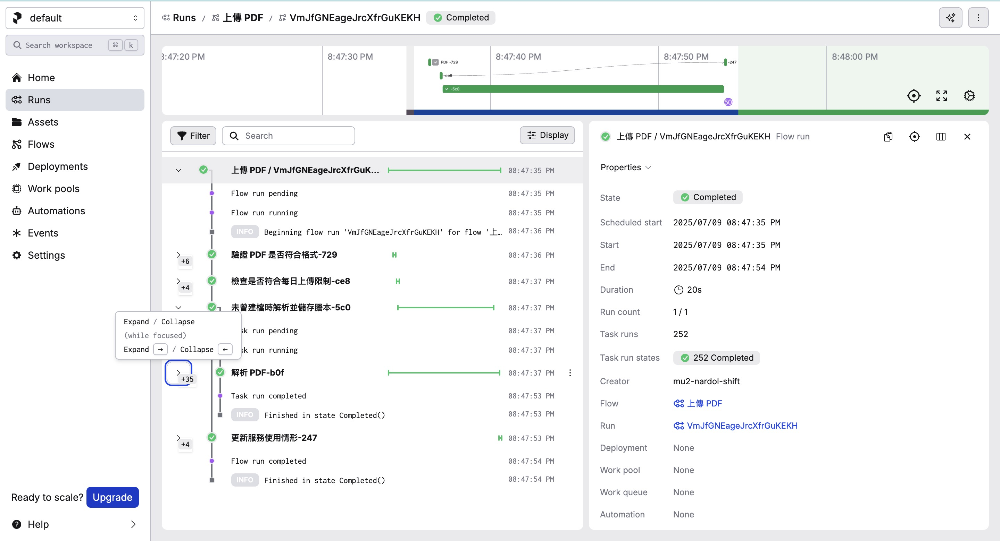

### Development Preparation

1. Based on `.env.example`, create `src/.env`.
2. Based on `env.test.example`, create `.env.test`.
3. Create virtual environment:
    ```bash
    uv venv -p src/venv
    ```
4. Install dependencies:
    ```bash
    make install
    ```
5. Obtain `credentials.json`:
   Before running tests, you must obtain the ID Token. Run `make login` to authenticate in the browser and save the ID Token and Refresh Token into `credentials.json`.

---

### Project Structure Overview
```txt
.
├── assets
│   ├── sample_image_hash.dat
│   ├── sample_image.dat
│   ├── sample_ocr_result.txt
│   └── sample_pdf.dat
├── conftest.py
├── credentials.json
├── Dockerfile
├── firebase.json
├── Makefile
├── prefect.toml
├── prefect.toml.example
├── pyproject.toml
├── README.md
├── screenshot.jpeg
├── src
│   ├── main.py
│   ├── requirements.txt
│   └── taiwan_geodoc_hub
│       ├── adapters
│       │   ├── auth
│       │   │   └── user_auth_adapter.py
│       │   ├── browser
│       │   │   └── auth_pyppeteer_adapter.py
│       │   ├── file_system
│       │   │   └── credential_file_system_adapter.py
│       │   └── firestore
│       │       ├── ocr_result_firestore_adapter.py
│       │       ├── process_state_firestore_adapter.py
│       │       ├── registration_firestore_adapter.py
│       │       ├── role_firestore_adapter.py
│       │       ├── snapshot_firestore_adapter.py
│       │       ├── tenant_daily_usage_firestore_adapter.py
│       │       ├── tenant_firestore_adapter.py
│       │       └── tenant_snapshot_ownership_firestore_adapter.py
│       ├── entrypoints
│       │   ├── cli
│       │   │   └── typer
│       │   │       ├── __init__.py
│       │   │       └── auth
│       │   │           └── __init__.py
│       │   └── http
│       │       └── starlette
│       │           └── __init__.py
│       ├── infrastructure
│       │   ├── clients
│       │   │   ├── http
│       │   │   │   ├── google_securetoken_api.py
│       │   │   │   └── ocr_space.py
│       │   │   └── pubsub
│       │   │       └── event_publisher.py
│       │   ├── formatters
│       │   │   └── cloud_logging_json_formatter.py
│       │   ├── generators
│       │   │   └── trace_id_generator.py
│       │   ├── hashers
│       │   │   ├── bytes_hasher.py
│       │   │   └── hmac_signer.py
│       │   ├── helpers
│       │   │   └── media
│       │   │       └── pdf
│       │   │           └── pdf_text_ripper.py
│       │   ├── process_managers
│       │   │   ├── bloc.py
│       │   │   └── cubit.py
│       │   └── transactions
│       │       └── firestore_unit_of_work.py
│       ├── modules
│       │   ├── access_managing
│       │   │   ├── __init__.py
│       │   │   ├── application
│       │   │   │   └── queries
│       │   │   │       ├── resolve_credentials.py
│       │   │   │       ├── resolve_role.py
│       │   │   │       ├── resolve_tenant.py
│       │   │   │       └── resolve_user.py
│       │   │   ├── constants
│       │   │   │   └── roots.py
│       │   │   ├── domain
│       │   │   │   ├── ports
│       │   │   │   │   ├── auth_service.py
│       │   │   │   │   ├── credential_repository.py
│       │   │   │   │   ├── get_role_by_id_port.py
│       │   │   │   │   ├── get_tenant_by_id_port.py
│       │   │   │   │   ├── get_user_from_id_token_port.py
│       │   │   │   │   └── tenant_snapshot_ownership_repository.py
│       │   │   │   └── services
│       │   │   │       ├── is_root.py
│       │   │   │       └── is_token_valid.py
│       │   │   ├── dtos
│       │   │   │   ├── credentials.py
│       │   │   │   ├── role.py
│       │   │   │   ├── tenant_snapshot_ownership.py
│       │   │   │   └── tenant.py
│       │   │   ├── exceptions
│       │   │   │   ├── permission_denied.py
│       │   │   │   ├── tenant_not_found.py
│       │   │   │   └── unauthorized.py
│       │   │   ├── presentation
│       │   │   │   ├── cli
│       │   │   │   │   └── handlers
│       │   │   │   │       └── handle_login.py
│       │   │   │   └── http
│       │   │   │       └── middlewares
│       │   │   │           ├── with_resolve_role.py
│       │   │   │           ├── with_resolve_tenant.py
│       │   │   │           └── with_resolve_user.py
│       │   │   ├── tests
│       │   │   │   └── integration
│       │   │   │       ├── test_role_dao.py
│       │   │   │       ├── test_tenant_dao.py
│       │   │   │       └── test_user_dao.py
│       │   │   └── types
│       │   │       ├── role_status.py
│       │   │       ├── role_type.py
│       │   │       └── tenant_status.py
│       │   ├── auditing
│       │   │   ├── __init__.py
│       │   │   ├── domain
│       │   │   │   └── ports
│       │   │   │       └── tenant_daily_usage_repository.py
│       │   │   └── dtos
│       │   │       └── tenant_daily_usage.py
│       │   ├── general
│       │   │   ├── __init__.py
│       │   │   ├── application
│       │   │   │   └── policies
│       │   │   │       ├── read_through_cache_policy.py
│       │   │   │       └── single_execution_policy.py
│       │   │   ├── constants
│       │   │   │   └── tokens.py
│       │   │   ├── domain
│       │   │   │   └── ports
│       │   │   │       ├── process_state_repository.py
│       │   │   │       └── unit_of_work.py
│       │   │   ├── dtos
│       │   │   │   └── process_state.py
│       │   │   ├── presentation
│       │   │   │   └── http
│       │   │   │       ├── handlers
│       │   │   │       │   └── exception_handler
│       │   │   │       │       └── __init__.py
│       │   │   │       └── middlewares
│       │   │   │           └── with_resolve_trace_id.py
│       │   │   ├── tests
│       │   │   │   ├── integration
│       │   │   │   │   ├── test_event_publisher.py
│       │   │   │   │   └── test_unit_of_work.py
│       │   │   │   └── unit
│       │   │   │       ├── test_bytes_hasher.py
│       │   │   │       └── test_environments_helper.py
│       │   │   └── types
│       │   │       ├── collection.py
│       │   │       ├── namespace.py
│       │   │       ├── process_status.py
│       │   │       └── topic.py
│       │   └── registration_managing
│       │       ├── __init__.py
│       │       ├── application
│       │       │   └── commands
│       │       │       └── upload_pdf.py
│       │       ├── constants
│       │       │   └── regexps.py
│       │       ├── domain
│       │       │   ├── ports
│       │       │   │   ├── get_registration_ids_port.py
│       │       │   │   ├── ocr_result_repository.py
│       │       │   │   ├── ocr_service.py
│       │       │   │   ├── registration_repository.py
│       │       │   │   └── snapshot_repository.py
│       │       │   └── services
│       │       │       ├── building_registration_info_parser.py
│       │       │       ├── building_registration_metadata_parser.py
│       │       │       ├── building_registration_other_rights_parser.py
│       │       │       ├── building_registration_ownerships_parser.py
│       │       │       ├── building_registration_parser.py
│       │       │       ├── building_registration_segmenter.py
│       │       │       ├── date_time_normalizer.py
│       │       │       ├── land_registration_info_parser.py
│       │       │       ├── land_registration_metadata_parser.py
│       │       │       ├── land_registration_other_rights_parser.py
│       │       │       ├── land_registration_ownerships_parser.py
│       │       │       ├── land_registration_parser.py
│       │       │       ├── land_registration_segmenter.py
│       │       │       ├── pdf_validator.py
│       │       │       ├── registration_splitter.py
│       │       │       ├── tenant_daily_usage_checker.py
│       │       │       └── text_ripper.py
│       │       ├── dtos
│       │       │   ├── 土地登記.py
│       │       │   ├── 建物登記.py
│       │       │   └── registration.py
│       │       ├── events
│       │       │   └── snapshot_uploaded.py
│       │       ├── exceptions
│       │       │   ├── invalid_pdf.py
│       │       │   └── tenant_max_snapshots_daily_limit_reached.py
│       │       ├── presentation
│       │       │   └── http
│       │       │       └── handlers
│       │       │           └── handle_upload_pdf.py
│       │       ├── tests
│       │       │   ├── e2e
│       │       │   │   └── test_registration_managing.py
│       │       │   ├── integration
│       │       │   │   └── test_ocr_space.py
│       │       │   └── unit
│       │       │       ├── test_registration_splitter.py
│       │       │       └── test_upload_pdf.py
│       │       └── types
│       │           └── registration_type.py
│       └── utils
│           ├── asyncio.py
│           ├── environments.py
│           ├── firebase
│           │   ├── boot_firebase.py
│           │   ├── credentials_from_env.py
│           │   ├── destructure_ce.py
│           │   ├── dispose_firebase.py
│           │   ├── ensure_topics.py
│           │   └── run_job.py
│           ├── lifespan
│           │   ├── __init__.py
│           │   ├── context.py
│           │   ├── lifespan.py
│           │   ├── shutdown.py
│           │   └── startup.py
│           └── logging
│               └── setup_logging.py
└── uv.lock
```

#### entrypoints/ - Entry Interfaces
- cli/typer/ – CLI commands
- http/starlette/ – HTTP server

#### infrastructure/ - Low-level Utilities
- formatters/ – Logging format
- generators/ – ID generators
- hashers/ – Hash/sign helpers
- helpers/media/pdf/ – PDF tools
- interfaces/ – Interfaces (ports)
- process_managers/ – Flow control (bloc/cubit)
- transactions/ – Unit of Work wrappers

#### modules/ - Business Domains

##### EX. registration_managing/
- application/ – Commands, queries, projections & policies ...
- domain/ – Parsers & validation
- dtos/, events/, exceptions/
- presentation/ – HTTP handler
- tests/ – E2E / unit tests


### Common Commands

| Command      | Description                                                                                                     |
| ------------ | --------------------------------------------------------------------------------------------------------------- |
| make dev     | Start Firebase emulators. The local endpoint will be `http://127.0.0.1:5001/taiwan-geodoc-hub/us-central1/upload`. |
| make login   | Obtain ID Token and Refresh Token and save them into `credentials.json`.                                        |
| make format  | Format the code.                                                                                                |
| make lint    | Lint the code.                                                                                                  |
| make test    | Run tests.                                                                                                      |
| make deploy  | Deploy to Firebase Functions.                                                                                   |
| make tree    | List the project structure.                                                                                     |